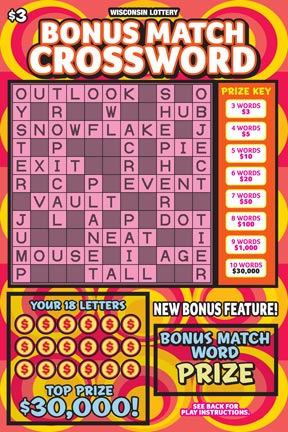

# crossword-puzzle-solver



[](https://github.com/RichardLitt/standard-readme)
TODO: Put more badges here.

> Inspired by crossword scratchers, you input the letters you scratch, you input the words on the scratcher, and it shows the revealed letters and words

## Table of Contents

- [Install](#install)
- [Usage](#usage)
- [Maintainers](#maintainers)
- [Contributing](#contributing)
- [License](#license)

## Install

```
```

## Usage

```
```

## Maintainers

[@dittmaraz](https://github.com/dittmaraz)

## Contributing


Small note: If editing the README, please conform to the [standard-readme](https://github.com/RichardLitt/standard-readme) specification.

## License

MIT © 2019 Sean Dittmar
